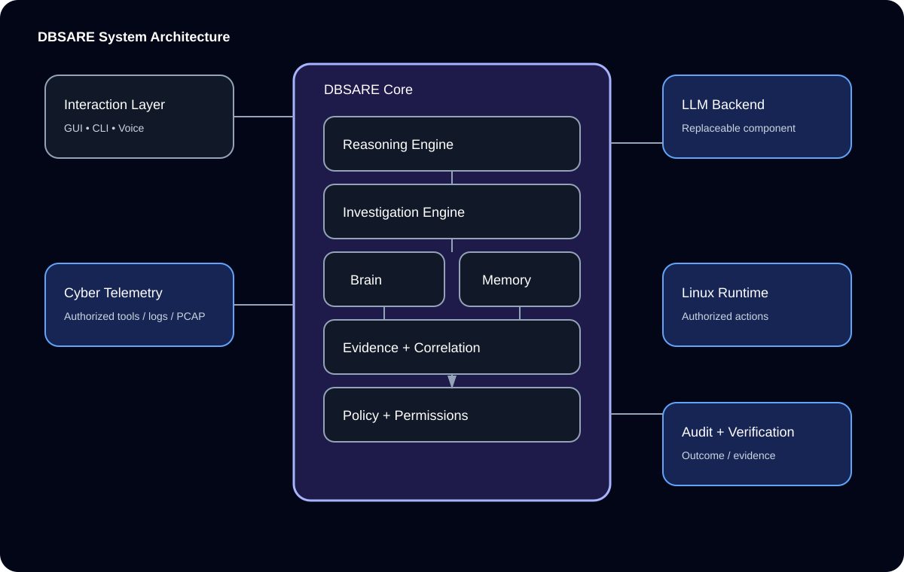
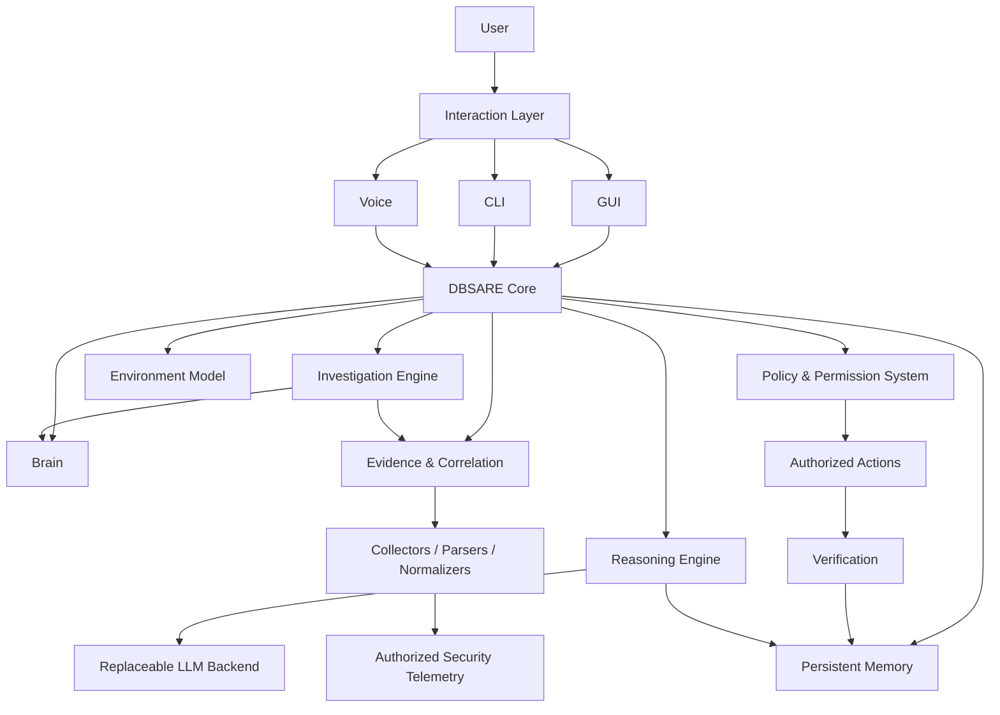

# DBSARE

<div align="center">

# DeepBlackStone Adaptive Reasoning Engine

**Linux-native AI Cyber Defense Engineer**

**English + العربية | Architecture • Evidence • Brain • Reasoning • Investigation • Security**

</div>

---


> **DBSARE is not an LLM with cybersecurity tools attached to it.**  
> DBSARE is a complete cybersecurity reasoning system. An LLM is only a replaceable component inside it.

---

## 🌐 Language / اللغة

- 🇬🇧 **[English](#english)**
- 🇸🇦 **[العربية](#العربية)**

---

# English

## Project Identity

DBSARE is a Linux-native AI cybersecurity system designed to operate as a defensive cyber-engineer platform inside **authorized and controlled environments**.

Its architecture is built around a complete lifecycle:

```text
Observe
   ↓
Understand
   ↓
Collect Evidence
   ↓
Normalize
   ↓
Correlate
   ↓
Analyze
   ↓
Reason
   ↓
Investigate
   ↓
Recommend
   ↓
Execute Authorized Actions
   ↓
Verify
   ↓
Learn / Retain Validated Knowledge
   ↓
Report
```

The project separates **system intelligence** from the **LLM backend**.

---

## 🧠 System Architecture





---

## 🔬 Brain vs Memory

### Brain

The **Brain** represents the cybersecurity environment known by DBSARE.

Examples:

```text
Host
 ├── runs → Service
 ├── exposes → Port
 ├── communicates_with → Host
 ├── resolves → Domain
 ├── generates → Event
 └── has → Vulnerability

Event
 └── associated_with → Evidence
```

### Memory

**Memory** represents what DBSARE retains over time:

- short-term context
- long-term memory
- cybersecurity knowledge
- environment history
- investigation history
- validated outcomes

Brain and Memory are connected, but they are **not the same subsystem**.

---

## 🔎 Evidence Pipeline

Security tools are evidence sources. Their output is never automatically treated as truth or instructions.


Every evidence item should preserve provenance:

```text
Source
 → Observation Time
 → Raw Evidence
 → Transformation
 → Normalized Evidence
 → Correlation
 → Decision / Investigation
```

---

## 🧩 Reasoning Model

DBSARE explicitly distinguishes:

| Type | Meaning |
|---|---|
| **Observed Fact** | Directly supported by evidence |
| **Derived Fact** | Deterministic transformation/correlation |
| **Hypothesis** | Candidate explanation requiring validation |
| **Inference** | Reasoned interpretation with uncertainty |
| **Recommendation** | Proposed next step |
| **Verified Outcome** | Result confirmed by evidence |

The project requires an **auditable reasoning trace**, not exposure of private model chain-of-thought.

A useful investigation path is:

```text
Evidence
   ↓
Correlation
   ↓
Hypothesis
   ↓
Missing Evidence
   ↓
Authorized Investigation
   ↓
Validation
   ↓
Conclusion + Confidence
   ↓
Recommendation
   ↓
Verification
```

---

## 🛡️ Security Architecture

DBSARE is designed around:

- least privilege
- explicit permissions
- policy enforcement
- command/tool allowlists
- approval gates
- observation/modification separation
- action validation
- output validation
- audit logging
- sandboxing/isolation
- safe defaults
- secrets protection
- prompt-injection resistance

External cyber data is treated as **untrusted data**.

Examples:

- logs
- DNS records
- filenames
- banners
- scanner output
- packet-derived text
- hostnames
- imported reports

Observed text must never silently become an instruction for the agent.

---

## 🖥️ Linux-Native

Target user experience:

```bash
git clone <repository>
cd DBSARE
./install.sh
dbsare
```

Target runtime layers:

```text
Linux
 ├── Hardware Detection
 ├── Runtime
 ├── LLM Backend
 ├── Cyber Telemetry
 ├── DBSARE Core
 ├── GUI
 ├── CLI
 └── Voice
```

The installer and runtime are developed progressively; README status labels never imply that a planned component already exists.

---

## 🎙️ One Core, Three Interfaces

```text
             ┌──────── GUI
             │
User ────────┼──────── CLI
             │
             └──────── Voice
                       ↓
                  DBSARE Core
                       ↓
          Brain + Memory + Evidence
                       ↓
             Reasoning + Investigation
```

GUI, CLI, and Voice are **interaction layers**, not separate brains.

---

## 🧪 Controlled Cyber Lab

DBSARE is evaluated in isolated, authorized environments:

```text
Attacker Simulator
        ↓
Target Network
 ├── Victim Hosts
 ├── Services
 └── Controlled Traffic
        ↓
Telemetry / Logs / PCAP
        ↓
Evidence Pipeline
        ↓
DBSARE Defender
```

No public or third-party system is required for the project demonstration.

---

## 🗺️ Complete Roadmap

| Phase | Scope | Status |
|---:|---|---|
| 0 | Architecture & Documentation | **Completed foundation** |
| 1 | Linux Foundation | **Implementation track** |
| 2 | LLM Abstraction | **Implementation track** |
| 3 | Cyber Evidence Layer | **Implementation track** |
| 4 | Environment Model | **Implementation track** |
| 5 | Brain & Persistent Memory | **Implementation track** |
| 6 | Reasoning & Correlation | **Implementation track** |
| 7 | Investigation Engine | **Implementation track** |
| 8 | Permission & Action System | **Implementation track** |
| 9 | GUI | **Implementation track** |
| 10 | Voice | **Implementation track** |
| 11 | Controlled Cyber Lab | **Implementation track** |
| 12 | Integrated PFE Demonstration | **Implementation track** |
| 13 | Future Research | **Research track** |

Detailed implementation tracking lives under `docs/roadmap/`.

---

## 📚 Documentation

### Architecture

- `docs/architecture/SYSTEM_ARCHITECTURE.md`
- `docs/architecture/COMPONENT_ARCHITECTURE.md`
- `docs/architecture/DATA_FLOW.md`
- `docs/architecture/TRUST_BOUNDARIES.md`
- `docs/architecture/ARCHITECTURAL_DECISIONS.md`
- `docs/architecture/DATA_CONTRACTS.md`
- `docs/architecture/FAILURE_MODEL.md`
- `docs/architecture/OBSERVABILITY.md`

### Brain / Memory

- `docs/brain/BRAIN_ARCHITECTURE.md`
- `docs/brain/ENTITY_MODEL.md`
- `docs/brain/RELATIONSHIP_MODEL.md`
- `docs/memory/MEMORY_ARCHITECTURE.md`
- `docs/memory/MEMORY_TYPES.md`
- `docs/memory/MEMORY_LIFECYCLE.md`

### Evidence / Reasoning / Investigation

- `docs/evidence/EVIDENCE_ARCHITECTURE.md`
- `docs/evidence/EVIDENCE_SCHEMA.md`
- `docs/evidence/NORMALIZATION.md`
- `docs/evidence/PROVENANCE.md`
- `docs/reasoning/REASONING_ARCHITECTURE.md`
- `docs/reasoning/HYPOTHESIS_MODEL.md`
- `docs/reasoning/CONFIDENCE_MODEL.md`
- `docs/investigation/INVESTIGATION_ENGINE.md`
- `docs/investigation/INVESTIGATION_LIFECYCLE.md`

### Security / Interfaces / Research

- `SECURITY.md`
- `docs/security/`
- `docs/llm/`
- `docs/linux/`
- `docs/gui/`
- `docs/cli/`
- `docs/voice/`
- `docs/research/`
- `docs/lab/`
- `docs/testing/`
- `docs/roadmap/`

---

## 🧱 Documentation-First Engineering

```text
Architecture
      ↓
Documentation
      ↓
Contracts
      ↓
Implementation
      ↓
Tests
      ↓
Validation
      ↓
Documentation Update
```

Unresolved architecture is recorded as an **Architectural Observation** rather than silently decided.

---

## 🔭 Research Direction

DBSARE is designed to become a research foundation for:

- graph reasoning
- continual knowledge acquisition
- autonomous investigation
- AI-assisted cyber defense
- multi-agent cybersecurity systems
- trustworthy AI
- evidence-grounded reasoning
- AI + cybersecurity research

`DBSARE_AI_PFE` remains a separate experimental track for studying candidate LLM internals and mechanistic interpretability.

---

## 📜 Status Policy

Project documentation uses explicit status language:

- **Implemented** — verified in the repository
- **Planned** — accepted future work
- **Experimental** — active experiment
- **Research** — research direction
- **Proposed** — design candidate

A diagram or roadmap item does not by itself mean the component is implemented.

---

## 📁 Repository Structure

```text
DBSARE/
├── core/
├── brain/
├── memory/
├── reasoning/
├── cyber/
├── evidence/
├── voice/
├── gui/
├── cli/
├── installer/
├── lab/
├── tests/
├── scripts/
└── docs/
```

---

# العربية

## تعريف المشروع

**DBSARE — DeepBlackStone Adaptive Reasoning Engine**

هو نظام دفاع سيبراني يعتمد على الذكاء الاصطناعي ويستهدف العمل بشكل **Linux-native** داخل بيئات مصرح بها ومراقبة.

DBSARE ليس مجرد نموذج LLM متصل بأدوات أمن سيبراني.

النظام الكامل يتكون من:

- طبقة التفاعل
- النواة الأساسية
- محرك الاستدلال
- محرك التحقيق
- Brain
- الذاكرة الدائمة
- النموذج البيئي للبيئة السيبرانية
- نظام الأدلة والربط
- نظام الصلاحيات والسياسات
- التكامل مع Linux
- المراقبة والتدقيق

---

## دورة العمل

```text
المراقبة
   ↓
الفهم
   ↓
جمع الأدلة
   ↓
التوحيد Normalization
   ↓
الربط Correlation
   ↓
التحليل
   ↓
الاستدلال
   ↓
التحقيق
   ↓
التوصية
   ↓
تنفيذ الإجراءات المصرح بها
   ↓
التحقق
   ↓
حفظ المعرفة الموثقة
   ↓
التقرير
```

---

## Brain و Memory

### Brain

يمثل ما يعرفه DBSARE عن البيئة السيبرانية والعلاقات الموجودة بينها.

مثال:

```text
Host
 ├── يشغّل → Service
 ├── يعرّض → Port
 ├── يتواصل مع → Host
 ├── يحل → Domain
 ├── يولّد → Event
 └── يحتوي على → Vulnerability
```

### Memory

تمثل المعلومات التي يحتفظ بها النظام:

- سياق الجلسة
- المعرفة طويلة المدى
- المعرفة السيبرانية
- حالة البيئة السابقة
- تاريخ التحقيقات
- النتائج التي تم التحقق منها

---

## الأدلة

مخرجات أدوات الأمن السيبراني تعتبر **أدلة غير موثوقة بشكل تلقائي** وليست أوامر.

المسار:

```text
Tool Output
   ↓
Collector
   ↓
Parser
   ↓
Normalizer
   ↓
Evidence
   ↓
Evidence Store
   ↓
Correlation
   ↓
Brain
   ↓
Reasoning
   ↓
Investigation
```

كل دليل يجب أن يحتفظ بمصدره وتوقيته وتحويلاته وعلاقاته.

---

## الاستدلال والتحقيق

يفرق DBSARE بين:

- حقيقة ملاحظة
- حقيقة مشتقة
- فرضية
- استنتاج
- توصية
- نتيجة تم التحقق منها

الهدف هو إنتاج استدلال قابل للتدقيق مبني على الأدلة، وليس كشف التفكير الداخلي الخاص بالنموذج.

---

## الأمن والصلاحيات

يعتمد النظام على:

- Least Privilege
- Explicit Permissions
- Policy Enforcement
- Allowlisting
- Approval Gates
- Audit Logging
- Verification
- Isolation
- حماية الأسرار
- مقاومة Prompt Injection

ولا توجد صلاحيات غير محدودة بشكل افتراضي.

---

## المختبر

يتم اختبار DBSARE في مختبر سيبراني معزول ومصرح به:

```text
Attacker Simulator
        ↓
Target Network
        ↓
Telemetry / Logs / PCAP
        ↓
DBSARE Defender
```

الهدف هو تقييم النظام بدون الاعتماد على أنظمة عامة أو أطراف ثالثة.

---

## خارطة الطريق

```text
Phase 0  → Architecture & Documentation
Phase 1  → Linux Foundation
Phase 2  → LLM Abstraction
Phase 3  → Cyber Evidence
Phase 4  → Environment Model
Phase 5  → Brain & Memory
Phase 6  → Reasoning & Correlation
Phase 7  → Investigation
Phase 8  → Permission & Actions
Phase 9  → GUI
Phase 10 → Voice
Phase 11 → Controlled Lab
Phase 12 → PFE Demonstration
Phase 13 → Future Research
```

---

<div align="center">

**DBSARE — Evidence-grounded AI Cyber Defense**

**DeepBlackStone**

</div>
